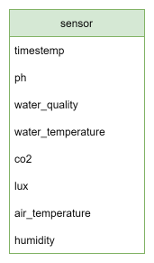

# Smartfarmer

- [Smartfarmer](#smartfarmer)
  - [1. 개요](#1-개요)
  - [2. 제작 기간 \& 참여 인원](#2-제작-기간--참여-인원)
  - [3. 사용 기술](#3-사용-기술)
  - [4. DB 설계](#4-db-설계)
  - [5. 핵심 기능](#5-핵심-기능)

  

## 1. 개요
- 현재 국내의 스마트팜 단계는 2.5세대입니다. 네덜란드의 경우 특정작물은 3세대(로봇) 스마트팜입니다.
- 따라서 그 사이 간극을 메우고자 개발하게 됐습니다.
- 최소한의 농장 방문으로 수확까지 이어지는 것이 최종 목표입니다.

  

## 2. 제작 기간 & 참여 인원
- 2021년 11월 ~ 2022년 6월
- 2인

  

## 3. 사용 기술

  

## 4. DB 설계

  

## 5. 핵심 기능
- 이 스마트팜의 핵심 기능은 농부가 직접 농장을 방문하지 않아도 농장의 상태를 확인할 수 있는 기능입니다.
  - 농장의 환경 요소를 확인할 수 있습니다.
  - 식물의 현재 성장단계를 확인할 수 있습니다.